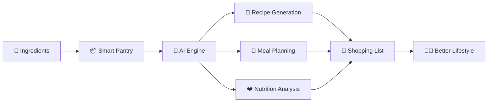

<div align="center">


# 🍳 CookPal

### Smart Kitchen Ecosystem Powered by AI

Cook smarter. Eat healthier. Waste less.

<p>
  
  
  
  
</p>

### 🚀 Transforming Every Kitchen Into a Smart Kitchen

_Helping people make healthier decisions, reduce food waste, and simplify cooking through intelligent automation._

</div>

---

## ✨ Why CookPal?

Every year, millions of tons of food are wasted while millions struggle to maintain healthy eating habits.

CookPal bridges that gap.

We combine **Artificial Intelligence**, **Nutrition Intelligence**, and **Kitchen Automation** to help people:

<table>
<tr>
<td width="50%">

### 🧠 Think Less

Stop spending time deciding what to cook.

### 🥬 Eat Better

Personalized meal plans aligned with your goals.

### 💸 Spend Smarter

Optimize groceries and reduce unnecessary purchases.

</td>
<td width="50%">

### 🌍 Waste Less

Prevent ingredients from expiring unused.

### ❤️ Stay Healthier

Nutrition-aware recommendations.

### ⚡ Save Time

Automated planning, tracking, and shopping.

</td>
</tr>
</table>

---

# 🎯 Our Vision

> To become Southeast Asia's leading AI-powered smart kitchen ecosystem.

We envision a future where every household can:

- Reduce food waste
- Improve nutrition
- Save money
- Cook with confidence
- Live sustainably

---

# 🏗 Ecosystem



---

# 🚀 Core Products

## 🤖 AI Recipe Generator

Generate recipes instantly from ingredients already available in your kitchen.

### Example

```
Ingredients:
- Chicken
- Tomato
- Garlic
- Onion

Result:
🍽 Garlic Tomato Chicken Bowl
🥗 Nutritional Breakdown
🛒 Missing Ingredients
```

---

## 📦 Smart Pantry

Track:

- Ingredient stock
- Expiration dates
- Consumption patterns
- Pantry analytics

Never forget what's inside your kitchen again.

---

## 🥗 Personalized Meal Planning

Meal recommendations powered by:

- Dietary preferences
- Fitness goals
- Medical restrictions
- Available ingredients

---

## ❤️ Health Intelligence

Integrated with:

- Apple Health
- Google Fit
- Wearables

Making every recommendation context-aware and personalized.

---

## 🛒 Auto Shopping List

Automatically generate grocery lists based on:

- Meal plans
- Inventory levels
- Upcoming recipes

---

## 🎮 Lifestyle Challenges

Build healthy habits through:

- Streaks
- Achievements
- Rewards
- Sustainability Challenges

---

# 🌱 Sustainability Impact

CookPal actively contributes to:

| Goal   | Description                          |
| ------ | ------------------------------------ |
| SDG 2  | Zero Hunger                          |
| SDG 3  | Good Health & Well-being             |
| SDG 11 | Sustainable Cities & Communities     |
| SDG 12 | Responsible Consumption & Production |

---

# 📈 Roadmap

### 2026

- [x] Product Validation
- [x] UI/UX Prototype
- [x] MVP Development
- [ ] AI Recipe Engine
- [ ] Health Integration
- [ ] Smart Pantry v1
- [ ] Mobile Application
- [ ] Public Beta Launch

---

# 🤝 Join Us

We're building the future of cooking.

Whether you're a:

- Software Engineer
- AI Engineer
- Product Designer
- Nutrition Expert
- Sustainability Enthusiast

We'd love to collaborate.

---

<div align="center">

# 🍳 Cook Smart. Live Better. Save The Planet.

### Made with ❤️ by CookPal

</div>
